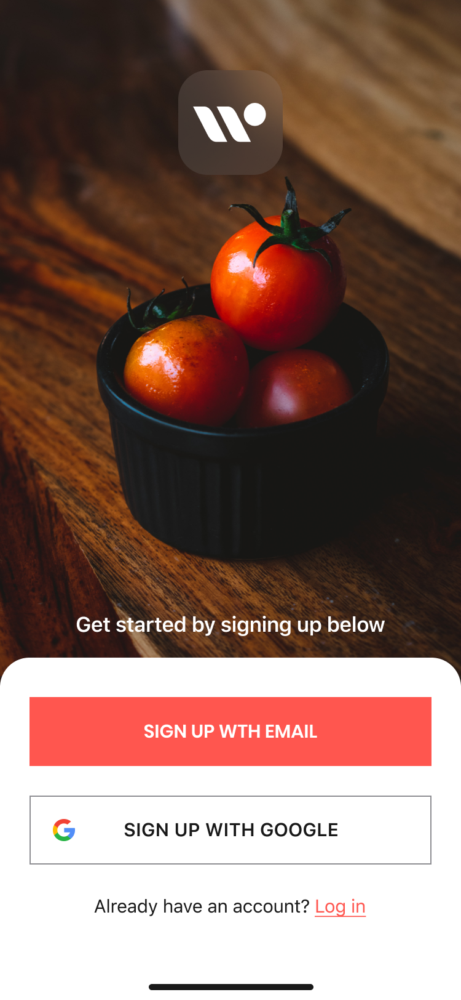
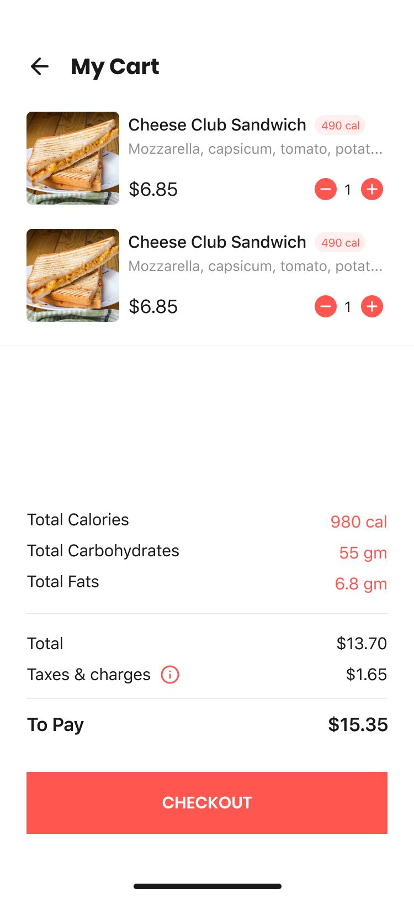

# Foodify-client
- Food delivery application developed as a part of CS-314 Android Development project.
- Used Java for android with Nodejs and MySQL backend. 

### Features
- User can browse food items and search and sort them.
- User can add items to the cart and place the order
- User can track the order on the map.

### Screenshots
Login Prompt             |  Items             |  Cart
:-------------------------:|:-------------------------:|:-------------------------:
|  | |  |
